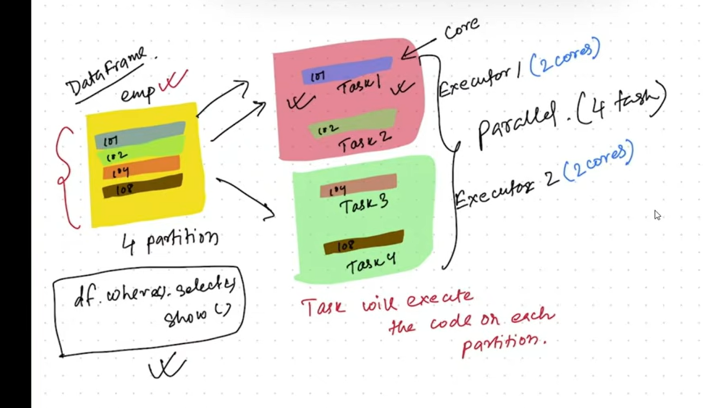

# SPARK ARCHITECTURE & EXECUTION CONTEXT

## Core Components

### Driver (Instructor)
- **Role**: The brain/instructor of the Spark application
- **Responsibilities**:
  - Maintains info about executors and overall application state
  - Analysis, distribution, scheduling, and monitoring of tasks
  - Converts user code into DAG (Directed Acyclic Graph)
  - Creates Jobs, Stages, and Tasks
  - Communicates with executors for task execution
  
### Executors
- **Role**: Worker nodes that execute tasks
- **Responsibilities**:
  - Executes code (tasks) assigned by driver
  - Responds to driver for task execution results
  - Stores data in memory or on disk as needed
  - Each executor runs in its own JVM
  - Launched at application start and run for entire application lifetime
  - Have multiple cores available for parallel task execution

### Executor JVM 
- Each executor runs in its own JVM
- Executors are launched at the beginning of a Spark application and typically run for the entire lifetime of the application
- Executors are responsible for executing tasks and storing data in memory or on disk as needed

## Execution Hierarchy

### Jobs
- Initial action (collect(), save(), show(), count(), etc.) triggers a job
- Each job can have multiple stages

### Stages  
- Jobs are divided into stages based on shuffle operations
- A stage contains all tasks that don't require data exchange between executors
- Tasks in a stage can run in parallel

### Tasks
- Smallest unit of work executed on a single core
- Each task processes a partition of data
- Multiple tasks can run simultaneously on different cores of the same executor

### Shuffle (Individual Core Data Transfer)
- Data transfer operation between cores/executors
- Occurs when:
  - groupByKey(), reduceByKey(), join() operations
  - Data from one partition needs to go to another partition
- Creates a new stage boundary (divides execution into multiple stages)
- Expensive operation (involves I/O and network transfer)

## Task Distribution Across Cores

```
        ┌─────────────────────────────────────────┐
        │      Spark Application (Driver)         │
        │   - Analyzes code                       │
        │   - Creates Jobs & Stages               │
        │   - Schedules Tasks                     │
        │   - Monitors Progress                   │
        └──────────────┬──────────────────────────┘
                       │
                       │ (assigns tasks)
                       │
             ┌─────────┴─────────┐
             │       Job         │ (triggered by action)
             └─────────┬─────────┘
                       │
        ┌──────────────┴──────────────┐
        │   Stage 1 (no shuffle)      │ Stage 2 (after shuffle)
        │   ┌────────────────────┐   │ ┌────────────────────┐
        │   │ Task1 Task2 Task3  │   │ │ Task4 Task5 Task6  │
        └───┼────────────────────┼───┘ └────────────────────┘
            │                        │
    ┌───────┴────────┐      ┌────────┴───────┐
    │    SHUFFLE     │ Data │   Redirection  │
    │   (Exchange)   │ Flow │                │
    └────────────────┘      └────────────────┘
            │                       │
    ┌───────┴────────────────────────┴──────────┐
    │                                            │
    │  ┌──────────────────────────────────────┐ │
    │  │   Executor 1 (JVM)                   │ │
    │  │  ┌─────────┬─────────┬─────────┐    │ │
    │  │  │  Core 0 │  Core 1 │  Core 2 │    │ │
    │  │  │ (Task1) │ (Task2) │ (Task3) │    │ │
    │  │  └─────────┴─────────┴─────────┘    │ │
    │  │  After Shuffle:                     │ │
    │  │  ┌─────────┬─────────┬─────────┐    │ │
    │  │  │  Core 0 │  Core 1 │  Core 2 │    │ │
    │  │  │ (Task4) │ (Task5) │ (Task6) │    │ │
    │  │  └─────────┴─────────┴─────────┘    │ │
    │  └──────────────────────────────────────┘ │
    │                                            │
    │  ┌──────────────────────────────────────┐ │
    │  │   Executor 2 (JVM)                   │ │
    │  │  ┌─────────┬─────────┬─────────┐    │ │
    │  │  │  Core 0 │  Core 1 │  Core 2 │    │ │
    │  │  │         │         │         │    │ │
    │  │  └─────────┴─────────┴─────────┘    │ │
    │  └──────────────────────────────────────┘ │
    └────────────────────────────────────────────┘
```

## Execution Flow Example

**Data Processing Context:**
- 1 Partition = 1 Task
- 1 Core = Can execute 1 Task at a time
- 1 Executor with 4 Cores = Can execute 4 Tasks in parallel

**Example Scenario:**
```
Input: 100 partitions
Executor: 4 cores available

Stage 1 (map operations - no shuffle):
- Task 1-4 run in parallel on cores 0-3 (processing partitions 1-4)
- Task 5-8 run in parallel on cores 0-3 (processing partitions 5-8)
- ... continues until all 100 partitions processed

SHUFFLE HAPPENS HERE ↓
(Data reorganized based on keys, creates stage boundary)

Stage 2 (reduce operations - after shuffle):
- Tasks resume on same or different cores
- Data is now grouped by keys as needed for reduce operation
```

## Key Points

1. **Driver** = Instructor that orchestrates everything
2. **Executors** = Workers that do the actual work
3. **Cores** = Individual processing units within an executor (can run tasks in parallel)
4. **Tasks** = Work units assigned to cores
5. **Stages** = Logical groupings of tasks (divided by shuffle operations)
6. **Shuffle** = Data redistribution between cores/executors (expensive operation)
7. **Task Parallelism** = Number of cores determines how many tasks run simultaneously


