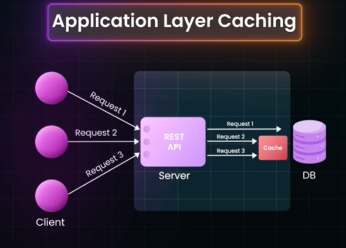
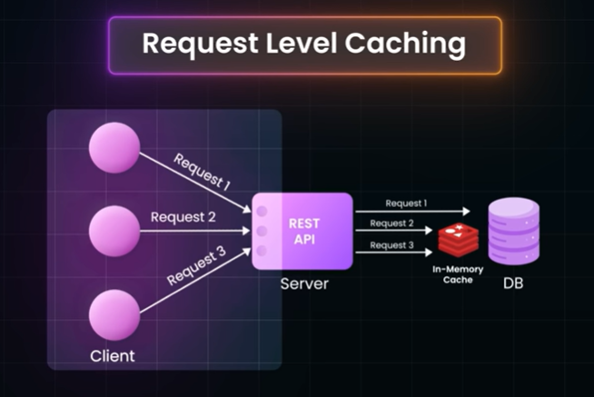
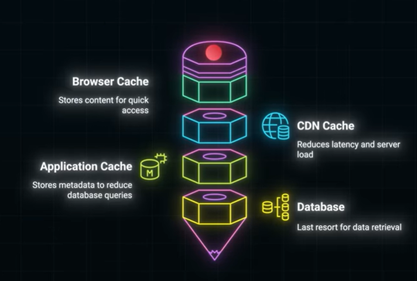
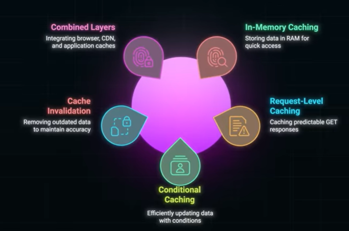

# REST API Caching Strategies Every Developer Must Know

**Reference:** [YouTube Video](https://www.youtube.com/watch?v=TV-xsNjbx_g)

---

## What is Caching?

Caching is about keeping a shortcut to frequently traveled paths. Instead of making expensive database queries repeatedly, we store results in fast-access storage.



### Core Benefits
- Higher traffic handled
- More requests served
- Reduced latency
- Lower database load

---

## Cache Hit vs Cache Miss

**Cache Hit**
- Data requested is found in cache
- Profile returned instantly
- Fast response time

**Cache Miss**
- Data not found in cache
- Fetch from database
- Store in cache for future requests
- Slower first request, faster subsequent ones

---

## In-Memory Cache Storage

### Popular Technologies
- **Redis** - High-performance, flexible data structure store
- **Memcached** - Simple, fast distributed memory caching

### Time to Live (TTL)
- Expiration attribute for cache entries
- Auto-remove data after certain time
- Balance between freshness and performance
- Prevents stale data indefinitely

### Example: Request-Level Caching
```
User Request
    ↓
Check Cache (Redis/Memcached)
    ├─ Hit: Return cached data instantly
    └─ Miss: Query DB → Store in cache → Return data
```



**Benefit:** Subsequent requests are fetched from Redis for extremely fast access

---

## Cache Key Strategy

### Unique Cache Keys
Every cached item needs a unique identifier based on the request characteristics:

**URL + Query Parameters**
```
GET /users/123/profile
Cache Key: "users:123:profile"

GET /comments?offset=0&limit=20
Cache Key: "comments:offset_0:limit_20"
```

### Multiple Variations
```
GET /users/123      → Cache Key: "users:123"
GET /users/456      → Cache Key: "users:456"
Different user IDs = Different cache keys

GET /comments?offset=0&limit=20  → One key
GET /comments?offset=20&limit=20 → Different key
```

This ensures data consistency across different queries.

---

## Cache Invalidation Strategies

Keeping cache synchronized with database is crucial to avoid stale data issues.

### Strategy 1: Write-Through Cache
```
Write Request
    ↓
Update Database AND Cache simultaneously
    ↓
Both always in sync
```

**When to Use:**
- High consistency required
- Low write frequency
- Data must always be accurate

**Pros:** Strong consistency
**Cons:** Slower writes, both updates must succeed

### Strategy 2: Write-Behind Cache
```
Write Request
    ↓
Update Database first
    ↓
Then update Cache ASYNCHRONOUSLY
    ↓
Cache might be stale for short time
```

**When to Use:**
- High write frequency
- Slightly stale data acceptable
- Performance is critical

**Pros:** Faster writes, decoupled operations
**Cons:** Possible stale data temporarily

### Strategy 3: TTL-Based Expiration
```
Data cached with TTL: 5 minutes
After 5 minutes: Auto-remove from cache
Next request: Fetch fresh data from DB
```

**When to Use:**
- Data changes periodically
- Read-heavy operations
- Freshness not critical
- Simple implementation needed

---

## Conditional Caching: Smart Cache Validation

### Etag Header (Entity Tag)
- Unique identifier for resource version
- Hash of resource content
- Changes when resource changes

```
Response Header: Etag: "abc123"
Next Request: If-None-Match: "abc123"
If Etag matches: Server responds 304 Not Modified
Client uses cached version
```

### Last-Modified Header
- Timestamp of last modification to resource
- Example: `Wed, 21 Oct 2023 07:28:00 GMT`

```
Response Header: Last-Modified: Wed, 21 Oct 2023 07:28:00 GMT
Next Request: If-Modified-Since: Wed, 21 Oct 2023 07:28:00 GMT
If unchanged: Server responds 304 Not Modified
If changed: Server responds with new data (200 OK)
```

### Benefits
- Saves bandwidth - No full resource transfer if unchanged
- Reduces latency - Client uses cached version
- Reduces server load - Fewer full responses needed

---

## Multi-Level Caching Architecture

Optimize performance across the entire stack by caching at multiple levels:

### 1. Browser Cache
- Store static assets (images, CSS, JavaScript)
- Reduce server requests
- Faster page load times
- Configured via HTTP headers

### 2. CDN Cache (Content Delivery Network)
- Distribute content globally
- Reduce latency for geographically dispersed users
- Reduce server load
- Serve content from nearest edge location

### 3. Application Cache
- In-memory caching (Redis, Memcached)
- Cache frequently accessed data
- Business logic cache
- Session cache

### 4. Database Cache
- Query result caching
- Reduce database load
- Internal database caching mechanisms

### Benefits of Multi-Level Caching
```
Browser Cache     ← Fastest (local)
    ↓
CDN Cache         ← Very fast (global)
    ↓
App Cache         ← Fast (in-memory)
    ↓
Database Cache    ← Slower (disk I/O)
    ↓
Direct Query      ← Slowest
```



---

## Cache Strategy Decision Matrix

| Scenario | Best Strategy | Reason |
|----------|---------------|--------|
| User profile updates | Write-Through | Must be consistent |
| High-volume analytics | Write-Behind | Performance matters |
| Weather data | TTL-Based | Data refreshes periodically |
| Static content | Browser + CDN | Long shelf life |
| Session data | In-Memory | Fast access critical |

---

## Best Practices

1. **Measure and Monitor**
   - Track cache hit/miss ratios
   - Optimize cache keys based on patterns

2. **Set Appropriate TTLs**
   - Not too short (defeats caching purpose)
   - Not too long (stale data)
   - Based on data change frequency

3. **Use Conditional Headers**
   - Implement Etag/Last-Modified
   - Reduce unnecessary data transfer

4. **Multi-Level Caching**
   - Leverage browser, CDN, app, and database caches
   - Each layer serves different use case

5. **Cache Invalidation Strategy**
   - Choose based on consistency requirements
   - Document and communicate strategy

---

## Result: Fast, Scalable, and Production-Ready APIs

Implementing proper caching strategies transforms APIs from basic to production-grade systems capable of handling:
- ✓ High traffic volumes
- ✓ Low latency responses
- ✓ Reduced database load
- ✓ Better user experience




