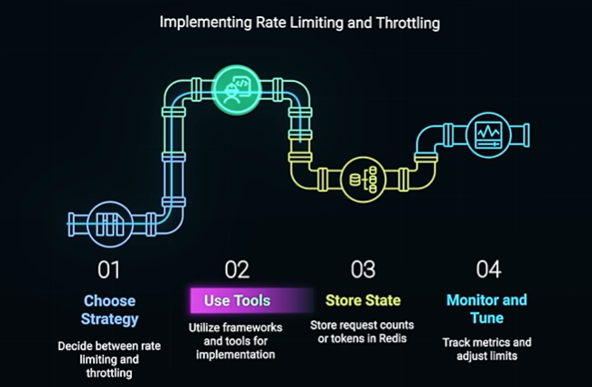

# How Rate Limiting and Throttling Saves Your API Server From CRASHING!

**Reference:** [YouTube Video](https://www.youtube.com/watch?v=_qNHROq0pGk)

---

## Overview

Rate limiting and throttling are essential techniques to **control the flow of incoming requests to an API server** to prevent overload and ensure fair usage among clients. They protect your infrastructure from being overwhelmed.

---

## Rate Limiting

### Definition
Sets a cap on the number of requests a client can make within a specific time window.

### How It Works
```
Allowed: 100 requests per minute
Request 101: Return 429 Too Many Requests error
Client must wait until window resets
```

### Rate Limiting Rules
```
100 or 1000 requests per minute
- If limit is exceeded → 429 error (Too Many Requests)
- Client gets rejected
- Request handling is DENIED
```

### Use Cases

**Security: Prevent Brute Force Attacks**
```
Login endpoint: 5 attempts per minute
- Attacker tries to guess password
- After 5 failed attempts, further requests denied
- Prevents automated attack attempts
```

**Fair Usage Policy**
- Ensure all users get equal access
- Prevent one user from monopolizing resources
- Enforce subscription tier limits

### Algorithms

**Token Bucket Algorithm**
```
Bucket starts with N tokens
Each request consumes 1 token
Tokens refill at fixed rate (e.g., 10 per second)
When empty: Request denied
```

---

## Throttling

### Definition
**Slowing down the rate of requests** by delaying or limiting the processing of requests. Manages requests more gracefully instead of rejecting them outright.

### Key Characteristics
- Requests are not denied
- Processing is delayed or slowed
- Increased latency but guaranteed processing
- Maintains service availability

### Throttling Types

**Static Throttling**
- Fixed delays for all requests beyond limit
- Simple to implement
- Predictable behavior

**Dynamic Throttling**
- Adjusts delays based on server conditions:
  - **CPU** utilization
  - **Memory** consumption
  - **Queue** length
- Adapts to current system state

**Adaptive Throttling**
- Uses machine learning and advanced heuristics
- Predicts server load patterns
- Proactively adjusts throttling parameters
- More sophisticated approach

### Benefits
- Preserves user experience
- Server processes all requests but at controlled rate
- Better than dropping requests entirely
- Handles traffic spikes gracefully

### Algorithms

**Leaky Bucket Algorithm**
```
Bucket holds requests
1 unit is processed per second (steady rate)
- If request comes and bucket is full: Request is delayed
- If bucket not full: Request added immediately
Burst of requests handled at steady rate
Maintains constant processing rate
```

---

## Rate Limiting vs Throttling

| Aspect | Rate Limiting | Throttling |
|--------|---------------|-----------|
| **Action** | Deny/Reject | Delay/Slow |
| **Response** | 429 error | 200 with delay |
| **User Experience** | Immediate failure | Patience required |
| **Use Case** | Security, strict limits | Load management |
| **Best For** | Login attempts, brute force | Traffic spikes |

---

## Combined Strategy

For optimal API protection, use **combination of rate limiting AND throttling**:

```
Request arrives
    ↓
Check Rate Limit
├─ Exceeded → Return 429 (Rate Limiting)
└─ Within limit → Process
    ↓
Check Server Load
├─ High load → Delay request (Throttling)
└─ Normal load → Process immediately
```



### Benefits of Combined Approach
- ✓ Security: Prevents attacks with rate limiting
- ✓ Resilience: Handles spikes with throttling
- ✓ Fairness: Ensures all users get access
- ✓ Predictability: Consistent service availability

---

## Implementation Best Practices

1. **Set Reasonable Limits**
   - Based on server capacity
   - Tiered by user/subscription level
   - Documented clearly

2. **Communicate Limits**
   - Include rate limit headers in response
   - Tell clients how many requests remain
   - Provide reset time

3. **Monitor and Adjust**
   - Track rate limit violations
   - Identify abuse patterns
   - Adjust limits based on usage

4. **Graceful Degradation**
   - Throttle before server crashes
   - Return informative error messages
   - Suggest retry timing

5. **Different Strategies by Endpoint**
   - Authentication: Strict rate limits (5 attempts/min)
   - Public API: Moderate limits (1000/hour)
   - Internal API: Higher limits (10000/hour)

