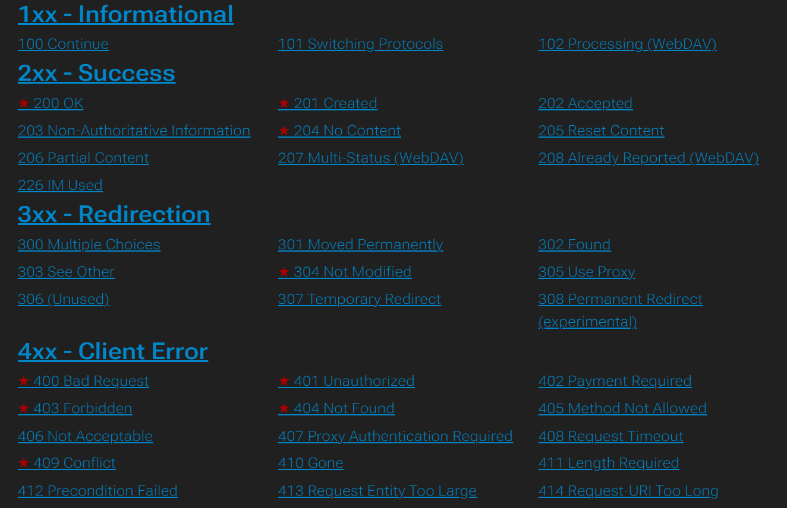
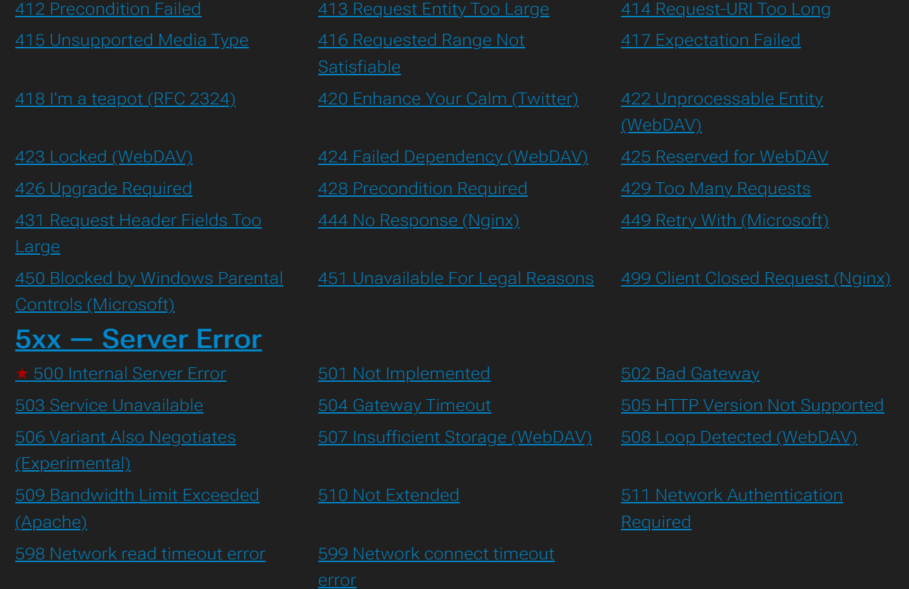

# Learn HTTP Status Codes In 10 Minutes

**Reference:** [YouTube Video](https://www.youtube.com/watch?v=wJa5CTIFj7U)

**Complete Reference:** [REST API Tutorial - HTTP Status Codes](https://www.restapitutorial.com/httpstatuscodes)

---

## Overview

HTTP status codes are a **structured way to communicate the result of requests made** to a web server. They provide standardized responses that inform clients about request success, failure, or required action.




### Status Code Format
```
HTTP Status Code: [3-digit number]
- First digit: Category (1-5)
- Last two digits: Specific code
```

---

## 1xx Information (Informational)

Rarely used in modern APIs. Indicate that the request has been received and processing continues.

- `100 Continue` - Client may continue sending request body
- `101 Switching Protocols` - Server is switching protocols

---

## 2xx Success (Success)

The request was successfully received, understood, and accepted.

### 200 OK
- Request successful
- Response contains requested data
- Most common success response
- Safe to retry: Yes
- Example: `GET /users` returns user list

### 201 Created ✓ Important
- New resource successfully created
- **POST should usually return this**
- Response includes location of new resource
- Status line: `201 Created`
- Safe to retry: No (would create duplicate)
- Example: `POST /users` creates and returns new user

### 204 No Content
- Request successful
- Action completed but nothing to return
- Response body is empty
- Safe to retry: Yes
- Example: `DELETE /users/123` successfully deletes user

---

## 3xx Redirection

The request requires further action or the resource has moved.

### 304 Not Modified ✓ Important for Caching
- Related to caching mechanisms
- Resource has NOT changed since last request
- Client should use cached version
- Server checking if changes happened
- Saves bandwidth by not sending full resource
- Safe to retry: Yes
- Example: Browser checks `If-Modified-Since` header, receives 304

**How it works:**
```
Request 1: GET /users/123
Response: 200 OK with data and Last-Modified header

Request 2: GET /users/123 with If-Modified-Since header
Response: 304 Not Modified (pull from cache)
```

### Other Common 3xx Codes
- `301 Moved Permanently` - Resource permanently moved
- `302 Found` - Temporary redirect
- `307 Temporary Redirect` - Temporary move (preserves method)

---

## 4xx Client Error

The request has an error on the client side. Client must modify request.

### 400 Bad Request
- Information sent is not correct
- Bad parameters sent by client
- Malformed request syntax
- Missing required fields
- Invalid data types
- Safe to retry: No (same error will occur)
- Example: Missing email field in POST body

### 401 Unauthorized
- Access that requires authentication
- Client not authenticated
- Need to pass authentication key/token
- Credentials missing or invalid
- Safe to retry: Yes (after providing credentials)
- Example: Accessing protected endpoint without token

**Response might include:**
```
WWW-Authenticate: Bearer realm="api"
```

### 403 Forbidden
- Authentication provided but access denied
- Key/token sent but access is forbidden
- User authenticated but lacks permissions
- Authorization failed
- Safe to retry: No (permissions won't change)
- Example: User is authenticated but not admin; accessing admin endpoint

**Difference from 401:**
```
401: Who are you? (Authentication needed)
403: You are authenticated, but you can't access this (Authorization failed)
```

### 404 Not Found
- Resource does not exist
- Accessing endpoint/resource that doesn't exist
- Wrong URL or resource deleted
- Safe to retry: Yes (maybe resource created later)
- Example: `GET /users/99999` where user doesn't exist

### 409 Conflict
- Request conflicts with current state of resource
- Data integrity issue
- Concurrency conflict
- Safe to retry: Maybe (depends on context)

**Example:**
```
PUT /users/123
{
  "name": "John",
  "email": "john@example.com"
  // Missing: "phone" field that was previously mandatory
}

Server response: 409 Conflict
Reason: Request missing mandatory field "phone"
```

---

## 5xx Server Error

The request is valid but server failed to process it. Server error, not client's fault.

### 500 Internal Server Error
- Something went wrong on server level
- Unexpected server condition
- Exception or unhandled error
- Generic server error
- Safe to retry: Yes (error might be temporary)
- Example: Database connection failure, uncaught exception

### Other Common 5xx Codes
- `501 Not Implemented` - Server doesn't support requested functionality
- `502 Bad Gateway` - Invalid response from upstream server
- `503 Service Unavailable` - Server temporarily unavailable
- `504 Gateway Timeout` - Upstream server didn't respond in time

---

## HTTP Status Code Categories Summary

| Category | Range | Meaning | Action |
|----------|-------|---------|--------|
| **Informational** | 1xx | Request received, processing continues | Continue |
| **Success** | 2xx | Request successful | Proceed |
| **Redirection** | 3xx | Further action needed | Follow redirect/check cache |
| **Client Error** | 4xx | Client made error | Fix request |
| **Server Error** | 5xx | Server error | Retry or contact support |

---

## Common HTTP Status Code Decision Tree

```
Request sent
    ↓
Processing successful?
├─ Yes → Action performed?
│  ├─ Yes → Resource created? → Yes: 201 Created
│  │                         → No: 200 OK
│  └─ No → 204 No Content (success but nothing returned)
│
└─ No → Authentication required?
   ├─ Yes → Already authenticated?
   │  ├─ Yes → 403 Forbidden (authenticated but not authorized)
   │  └─ No → 401 Unauthorized (not authenticated)
   └─ No → Validation failed?
      ├─ Yes → 400 Bad Request (malformed)
      └─ No → Server error → 500 Internal Server Error
```

---

## Best Practices

1. **Return Appropriate Status Codes**
   - Use 201 for resource creation (not 200)
   - Use 204 for successful deletion with no response
   - Use 400 for validation errors

2. **Include Response Body with Error**
   ```json
   400 Bad Request
   {
     "error": "Invalid email format",
     "field": "email",
     "message": "Please provide a valid email address"
   }
   ```

3. **Use Correct 401 vs 403**
   - 401: Missing/invalid credentials
   - 403: Valid credentials but insufficient permissions

4. **For Idempotent Operations**
   - Use same status code for retries
   - Example: 201 Created even if resource already exists

5. **Document Your Status Codes**
   - Specify which endpoints return which codes
   - Include error response examples
   - Help API consumers understand responses
    
