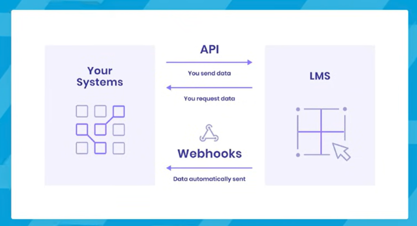

# What is a Webhook? Webhooks for Beginners

**Reference:** [YouTube Video](https://www.youtube.com/watch?v=mrkQ5iLb4DM&t=27s)

---

## Definition

A webhook is a mechanism that enables server-to-server communication. When one service wants to coordinate with an external service, webhooks provide an event-driven way to push data in real-time.

### How Webhooks Work

**Example Flow:**
```
Service A → GraphQL API → Webhook → External Service B
```

When a transaction occurs in Service A, it sends data to Service B via webhook instead of Service B constantly polling for updates.

---

## Key Concepts

### Event-Driven Architecture
- Setup webhooks triggered by specific events
- Can be synchronous or asynchronous
- Has excellent scalability
- Reduces polling overhead



### Real-World Example: Payment Processing
```
Razorpay Payment Gateway → Webhook → Your Web Server
- Transaction happens
- If powercut or internet stops, webhook may not deliver
- Razorpay retries with exponential backoff algorithm
```

---

## Security: Verifying Webhook Authenticity

### Identifying Legitimate Requests vs Attackers

**Challenge:** How to distinguish between legitimate webhooks and malicious requests?

**Solution: Message Signing**

1. **Secret Key Exchange**
   - Razorpay sends a signing secret (secret key) with webhook over HTTPS
   - Only your server and Razorpay know this secret

2. **Hash Verification Process**
   - Webhook message + secret key = cryptographic hash
   - Server calculates hash using same method
   - Compare calculated hash with `x-signature` header
   - If hashes match → Request is authentic
   - If hashes don't match → Request is suspicious/tampered

### Implementation
```
Received Header: x-signature: "abc123def456"
Calculated Hash: hash(message + secret_key) = "abc123def456"
Result: ✓ Verified - Authentic request
```

---

## Failure Handling & Retries

### Webhook Delivery Failures

When the receiving server returns status code **> 400**:
- Initial attempt failed
- Webhook provider tries endpoint again with **exponential backoff algorithm**
- Retry delays increase: 1s → 2s → 4s → 8s → 16s...
- After **5 failed attempts**, webhook is automatically disabled

### Example Retry Timeline
```
Attempt 1: Immediate
Attempt 2: 1 second delay
Attempt 3: 2 seconds delay
Attempt 4: 4 seconds delay
Attempt 5: 8 seconds delay
Result: Webhook disabled if all fail
```

---

## Core Pillars of Webhooks

### 1. Encryption
- Communication over HTTPS
- Message signing for verification
- Since client is not always reliable, strong security is essential

### 2. Events
- Event-driven architecture
- Real-time notifications
- Triggered by specific business actions

### 3. Dispatch to Different Providers
- Route webhooks to appropriate external services
- Handle different payload formats
- Support multiple destinations
- Failure handling and retries

---

## Advantages of Webhooks

✓ **Real-time Communication** - Instant notifications instead of polling
✓ **Reduced Latency** - No delays from polling intervals
✓ **Scalable** - Efficient for large-scale operations
✓ **Secure** - Message signing prevents spoofing
✓ **Cost-effective** - Reduces unnecessary network requests

---

## When to Use Webhooks

- Payment confirmations
- Order status updates
- User registration notifications
- Real-time data synchronization
- Third-party service integrations
- Event notifications across systems


 