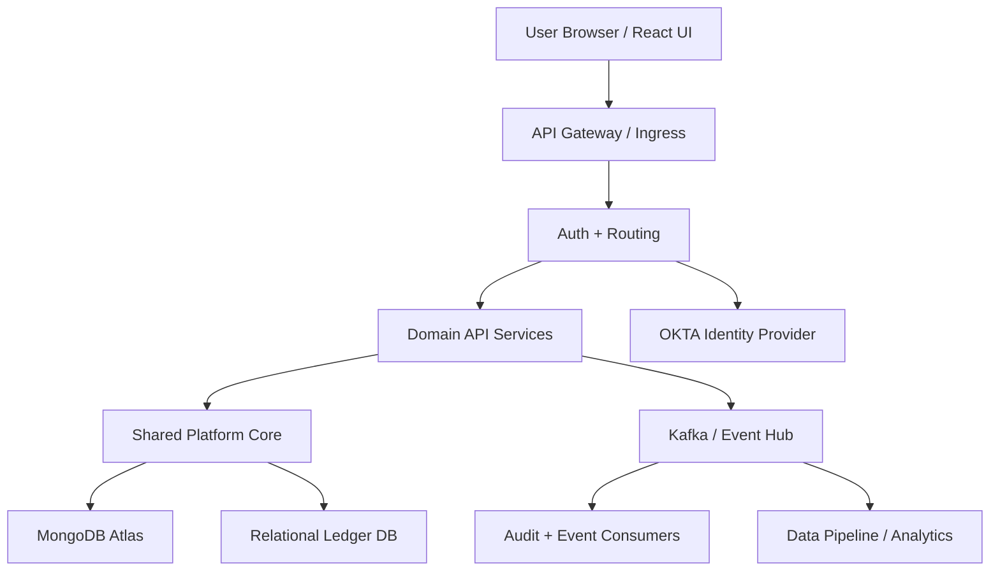

# Domain-Driven Microservice Platform

## 1. Problem Statement
This is a domain-driven microservice platform for pricing and deal modeling. The system supports browser-based deal creation/edit flows, pricing calculations, analytics/report exports, and audit/event processing.

## 2. High-Level Architecture
- User UI (React/browser) calls the system through an **API Gateway**
- The API Gateway handles:
  - routing
  - request validation
  - authentication/authorization
  - channel separation for external UX and internal services
- **OKTA** provides identity, auth, and role mapping
- Domain services implement business capabilities:
  - Pricing Service
  - Deal Service
  - Read/Export Service
  - Orchestration/business logic
- Persistent storage:
  - **MongoDB Atlas** as the primary operational store
  - optional **relational ledger/store** for financial consistency and audit
- **Event bus** (Kafka / Azure Event Hub) powers async audit, stream processing, and downstream integration
- A **shared platform core** provides common entities, DAO helpers, auth helpers, logging, config, and audit support

## 3. Low-Level Design
- API Layer
  - API Gateway / ingress
  - request validation
  - auth using OKTA
  - authorization and request routing
- Service Layer
  - business rules and orchestration
  - each service owns its domain logic
- DAO Layer
  - isolates persistence logic
  - maps domain entities to MongoDB and relational schemas
- Entity/Model Layer
  - common model definitions
  - schema consistency across services
- Event Layer
  - Kafka for audit events, event-driven updates, and analytics pipelines
  - Kafka consumers for audit/logging and data lake ingestion

## 4. Non-functional Design
- Scalability: microservices + event-driven async processing
- Reliability: use an event bus for decoupling and replayability
- Observability: centralized logging, audit trails, metrics
- Deployment: CI/CD pipeline with environment promotions (dev → qa → prod)
- Governance: config management, compliance, audit logging

## 5. Architecture Diagram

## 6. Interview Answer Structure
1. Start with the business goal and main domain.
2. Explain the component flow: UI → Gateway → services → storage/events.
3. Highlight the separation of concerns:
   - API/auth
   - business services
   - persistence/DAO
   - event streaming
4. Mention key tradeoffs:
   - use MongoDB for flexible operational data
   - use Kafka for async reliability and audit
   - use OKTA for centralized auth
5. Close with nonfunctional benefits: scalability, auditability, and CI/CD-driven release control.
